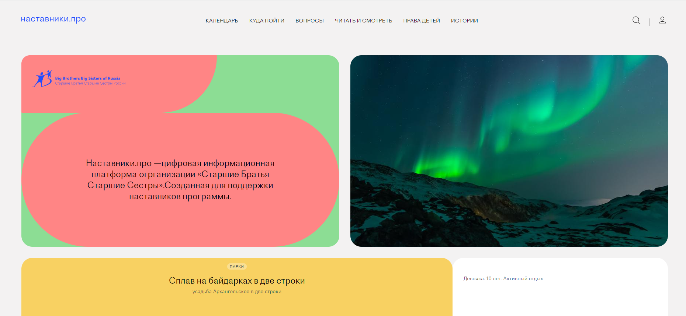

# Старшие Братья Старшие сестры

### Описание проекта
Представляем вашему вниманию проект, созданный для благотворительной органиации Старшие Братья Старшие Сестры. Проект представляет собой многостраничный сайт с возможностью авторизации. Кроме того, на нашем сайте можно просматривать предстоящие мероприятия, записываться на них или наоборот отказаться от участия. Если вам не интересны мероприятия, можно просто почитать об организации или проникнуться историями счастливых людей, которые уже преодолели все трудности с помощью фонда. Работа проводилась в рамках хакатона совместно с Яндекс Практикумом. 

### Разработчики
- [Айгуль Альмухаметова](https://github.com/Sseverniy)
- [Виктор Жаболенко](https://github.com/Kenzbrug)
- [Ринат Абдрахманов](https://github.com/NordWayne)
- [Артур Чухненко](https://github.com/CharlesMickey)
### Стек
- HTML5
- CSS3
- ReactJS
- BEM
- Git
- npm
